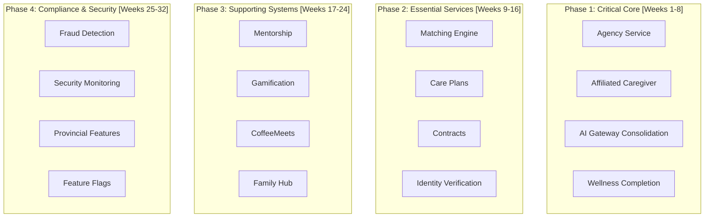

# Stage Three Architecture - Comprehensive Implementation Plan
## Bridging the Gap from Monolith to Microservices

**Document Version**: 1.0  
**Date**: December 2024  
**Estimated Duration**: 32 weeks (8 months)  
**Team Size**: 12-15 developers  

---

## 📋 Executive Summary

This implementation plan addresses the migration of **90 backend modules** with **542 services** from the monolithic architecture to Stage Three microservices. The plan includes creation of **12 new microservices**, enhancement of **26 existing services**, development of **7 new micro-frontends**, and porting of **30+ AI/ML modules**.

### Key Objectives
1. Achieve feature parity between monolith and Stage Three
2. Zero downtime migration using dual-write patterns
3. Maintain backward compatibility during transition
4. Implement enterprise-grade monitoring and observability
5. Ensure Canadian compliance (PIPEDA, provincial regulations)

---

## 🏗️ Implementation Architecture



---

## 👥 Team Structure & Allocation

### Core Teams

#### Team A: Agency & B2B Features (3 developers)
- **Lead**: Senior Backend Engineer
- **Members**: 2 Backend Engineers
- **Focus**: Agency service, billing, compliance, integrations
- **Deliverables**: 50 agency services, agency portal MFE

#### Team B: Caregiver Systems (3 developers)
- **Lead**: Senior Full-Stack Engineer
- **Members**: 1 Backend, 1 Frontend Engineer
- **Focus**: Affiliated caregivers, lifecycle management, registration
- **Deliverables**: 36 caregiver services, affiliated MFE

#### Team C: AI/ML Services (2 developers)
- **Lead**: ML Engineer
- **Members**: 1 Python Developer
- **Focus**: Consolidating 30+ AI modules
- **Deliverables**: Unified AI gateway service

#### Team D: Wellness & Healthcare (2 developers)
- **Lead**: Backend Engineer
- **Members**: 1 Full-Stack Engineer
- **Focus**: Wellness services, wearables, interventions
- **Deliverables**: 50+ wellness services

#### Team E: Platform & Infrastructure (2 developers)
- **Lead**: DevOps Engineer
- **Members**: 1 Platform Engineer
- **Focus**: Kubernetes, monitoring, CI/CD
- **Deliverables**: Infrastructure automation

#### Team F: Frontend & UX (2 developers)
- **Lead**: Senior Frontend Engineer
- **Members**: 1 Frontend Engineer
- **Focus**: Micro-frontends, UI components
- **Deliverables**: 7 new MFEs

### Support Roles
- **Project Manager**: 1 (coordination, reporting)
- **QA Engineers**: 2 (testing, automation)
- **Technical Architect**: 0.5 (oversight, design reviews)

---

## 📅 Phase 1: Critical Core Services (Weeks 1-8)

### Week 1-2: Foundation & Setup

#### Infrastructure Setup
```bash
# 1. Expand Kubernetes cluster
kubectl scale nodes --replicas=10

# 2. Deploy additional infrastructure
helm install temporal temporalio/temporal
helm install kafka bitnami/kafka
helm install elasticsearch elastic/elasticsearch

# 3. Set up monitoring
helm install prometheus prometheus-community/kube-prometheus-stack
helm install jaeger jaegertracing/jaeger
```

#### Database Migrations
```sql
-- Run critical migrations
1. CreatePolymorphicUserArchitecture
2. CanadianTimeZoneArchitecture
3. AddCaregiverComplianceTables
4. CreateAgencyTables
5. CreateAffiliatedCaregiverTables
```

#### Development Environment
```yaml
# docker-compose.stage3-complete.yml
version: '3.8'
services:
  # Add new services
  agency-service:
    build: ./services/agency-service
    ports: ["4050:4050"]
    environment:
      - DATABASE_URL=postgresql://...
      - KAFKA_BROKERS=kafka:9092
      - TEMPORAL_ADDRESS=temporal:7233
  
  affiliated-caregiver-service:
    build: ./services/affiliated-caregiver-service
    ports: ["4053:4053"]
```

### Week 3-4: Agency Service Implementation

#### Create Agency Service Structure
```typescript
// services/agency-service/src/main.ts
import { NestFactory } from '@nestjs/core';
import { MicroserviceOptions, Transport } from '@nestjs/microservices';
import { AgencyModule } from './agency.module';

async function bootstrap() {
  const app = await NestFactory.create(AgencyModule);
  
  // Enable microservice transports
  app.connectMicroservice<MicroserviceOptions>({
    transport: Transport.KAFKA,
    options: {
      client: { brokers: ['kafka:9092'] },
      consumer: { groupId: 'agency-service' }
    }
  });

  app.connectMicroservice<MicroserviceOptions>({
    transport: Transport.GRPC,
    options: {
      package: 'agency',
      protoPath: './proto/agency.proto',
      url: '0.0.0.0:5050'
    }
  });

  await app.startAllMicroservices();
  await app.listen(4050);
}
```

#### Port Agency Services (50 services)
| Service Group | Services | Priority | Week |
|---------------|----------|----------|------|
| Core | agency.service, agency-caregivers.service | HIGH | 3 |
| Billing | agency-billing.service, agency-payroll.service | HIGH | 3 |
| Compliance | agency-compliance.service, labor-law-validation.service | HIGH | 4 |
| Analytics | agency-analytics.service, agency-reporting.service | MEDIUM | 4 |
| Integrations | wellsky-integration.service, alayacare-integration.service | MEDIUM | 4 |

### Week 5-6: Affiliated Caregiver System

#### Implement Affiliated Caregiver Service
```typescript
// services/affiliated-caregiver-service/src/modules/affiliation/affiliation.service.ts
@Injectable()
export class AffiliationService {
  async affiliateCaregiver(caregiverId: string, agencyId: string) {
    // 1. Validate caregiver and agency
    // 2. Create affiliation record
    // 3. Set up agency-specific permissions
    // 4. Configure shift management
    // 5. Enable clock-in/out features
    // 6. Publish AffiliationCreatedEvent
  }

  async manageShifts(caregiverId: string, agencyId: string) {
    // Shift scheduling, swaps, overtime management
  }

  async trackCompliance(caregiverId: string, requirements: ComplianceRequirements) {
    // Provincial labor law compliance
    // Break time tracking
    // Overtime calculations
  }
}
```

#### Migration Strategy for Affiliated Caregivers
```typescript
// Dual-write pattern for gradual migration
class AffiliatedCaregiverMigrator {
  async migrate() {
    // 1. Identify affiliated caregivers in monolith
    const affiliatedCaregivers = await this.monolithDb.query(
      `SELECT * FROM caregivers WHERE agency_id IS NOT NULL`
    );

    // 2. Migrate in batches with verification
    for (const batch of chunk(affiliatedCaregivers, 100)) {
      await this.migrateWithDualWrite(batch);
      await this.verifyDataConsistency(batch);
    }
  }
}
```

### Week 7-8: AI Services Consolidation

#### Create Unified AI Gateway
```python
# services/ai-service/src/main.py
from fastapi import FastAPI
from typing import Dict, Any
import asyncio

app = FastAPI(title="Medi-Aide AI Gateway", version="2.0")

# Import all 30+ AI modules
from modules.schedule_optimization import ScheduleOptimizer
from modules.matching_engine import MatchingEngine
from modules.burnout_prediction import BurnoutPredictor
from modules.care_plan_assistant import CarePlanAssistant
from modules.wellness_chat import WellnessChat
# ... (import remaining 25+ modules)

# Initialize all services
services = {
    "schedule": ScheduleOptimizer(),
    "matching": MatchingEngine(),
    "burnout": BurnoutPredictor(),
    "care_plan": CarePlanAssistant(),
    "wellness_chat": WellnessChat(),
    # ... initialize all services
}

@app.post("/api/ai/{service}/{operation}")
async def unified_ai_endpoint(
    service: str, 
    operation: str, 
    request: Dict[str, Any]
):
    """Single endpoint for all AI operations"""
    if service not in services:
        raise HTTPException(404, f"Service {service} not found")
    
    service_instance = services[service]
    if not hasattr(service_instance, operation):
        raise HTTPException(404, f"Operation {operation} not found")
    
    # Execute operation with distributed tracing
    with tracer.start_span(f"ai.{service}.{operation}"):
        result = await getattr(service_instance, operation)(request)
    
    return result
```

#### AI Service Deployment
```yaml
# kubernetes/ai-service-deployment.yaml
apiVersion: apps/v1
kind: Deployment
metadata:
  name: ai-service
spec:
  replicas: 3
  template:
    spec:
      containers:
      - name: ai-service
        image: medi-aide/ai-service:latest
        resources:
          requests:
            memory: "4Gi"
            cpu: "2"
            nvidia.com/gpu: 1  # GPU for ML models
        env:
        - name: MODEL_CACHE_DIR
          value: /models
        volumeMounts:
        - name: model-cache
          mountPath: /models
      volumes:
      - name: model-cache
        persistentVolumeClaim:
          claimName: ai-model-cache
```

---

## 📅 Phase 2: Essential Services Enhancement (Weeks 9-16)

### Week 9-10: Wellness Service Completion

#### Port 50+ Wellness Services
```typescript
// Strategy: Group services by domain
const wellnessServiceGroups = {
  wearables: [
    'wearable.service',
    'wearable-integration.service',
    'garmin-push.service',
    'wearable-sync-queue.service'
  ],
  analytics: [
    'analytics.service',
    'predictive-analytics.service',
    'advanced-analytics-engine.service',
    'ml-recommendation-engine.service'
  ],
  interventions: [
    'intervention-engine.service',
    'simple-intervention.service',
    'wellness-monitoring.service'
  ],
  compliance: [
    'consent-management.service',
    'data-export.service',
    'anonymization.service',
    'encryption.service'
  ]
};

// Migrate each group with testing
for (const [group, services] of Object.entries(wellnessServiceGroups)) {
  await migrateServiceGroup(group, services);
  await runIntegrationTests(group);
  await enableFeatureFlag(`wellness_${group}_enabled`);
}
```

### Week 11-12: Matching Service Enhancement

#### Complete 27 Matching Services
```typescript
// services/matching-service/src/orchestrator/temporal-matching.workflow.ts
import { proxyActivities } from '@temporalio/workflow';

export async function MatchingWorkflow(careRequestId: string) {
  const { fetchCandidates, scoreWithAI, rankResults, notifyMatches } = 
    proxyActivities<typeof activities>({ startToCloseTimeout: '30s' });

  // 1. Fetch candidates with caching
  const candidates = await fetchCandidates(careRequestId);
  
  // 2. Parallel AI scoring
  const scores = await Promise.all(
    candidates.map(c => scoreWithAI(careRequestId, c.id))
  );
  
  // 3. Rank and filter
  const rankedMatches = await rankResults(candidates, scores);
  
  // 4. Progressive matching - notify in batches
  for (const batch of chunk(rankedMatches, 10)) {
    await notifyMatches(batch);
    await sleep('5m'); // Wait 5 minutes between batches
  }
  
  return rankedMatches;
}
```

### Week 13-14: Care Plan Service Completion

#### Implement Collaborative Editing
```typescript
// Real-time collaboration using CRDT
import * as Y from 'yjs';
import { WebsocketProvider } from 'y-websocket';

class CollaborativeCarePlanService {
  async enableCollaboration(carePlanId: string) {
    const ydoc = new Y.Doc();
    const provider = new WebsocketProvider(
      'wss://care-plan-service:4019/collab',
      carePlanId,
      ydoc
    );

    // Set up awareness for user presence
    provider.awareness.setLocalStateField('user', {
      name: currentUser.name,
      color: generateUserColor(currentUser.id)
    });

    // Handle concurrent edits
    ydoc.on('update', async (update) => {
      await this.saveToDatabase(carePlanId, update);
      await this.validateFHIRCompliance(carePlanId);
    });
  }
}
```

### Week 15-16: Contract Service Enhancement

#### Add E-Signature and Workflow
```typescript
// Temporal workflow for contract lifecycle
export async function ContractWorkflow(contractId: string) {
  const contract = await activities.generateContract(contractId);
  
  // Send for signatures
  const signatures = await Promise.all([
    activities.requestSignature(contract.patientId, 'patient'),
    activities.requestSignature(contract.caregiverId, 'caregiver')
  ]);
  
  // Verify and activate
  if (signatures.every(s => s.signed)) {
    await activities.activateContract(contractId);
    await activities.createCarePlan(contractId);
    await activities.scheduleFirstVisit(contractId);
  }
  
  return { contractId, status: 'activated' };
}
```

---

## 📅 Phase 3: Supporting Systems (Weeks 17-24)

### Week 17-18: Identity Verification Service

```typescript
// services/identity-verification-service/src/verification.service.ts
@Injectable()
export class IdentityVerificationService {
  constructor(
    private readonly personaClient: PersonaClient,
    private readonly ocrService: OCRService,
    private readonly fraudDetection: FraudDetectionService
  ) {}

  async verifyIdentity(userId: string, documents: Document[]) {
    // 1. OCR document extraction
    const extractedData = await this.ocrService.extract(documents);
    
    // 2. Third-party verification
    const personaResult = await this.personaClient.verify(extractedData);
    
    // 3. Fraud detection
    const fraudScore = await this.fraudDetection.analyze(userId, extractedData);
    
    // 4. Canadian-specific validation
    if (extractedData.country === 'CA') {
      await this.validateCanadianDocuments(extractedData);
    }
    
    return {
      verified: personaResult.verified && fraudScore < 0.3,
      confidence: personaResult.confidence,
      fraudScore
    };
  }
}
```

### Week 19-20: Mentorship Service

```typescript
// Complete mentorship matching and program management
class MentorshipService {
  async matchMentorMentee(menteeId: string) {
    // Use AI for optimal matching
    const candidates = await this.findMentorCandidates(menteeId);
    const scores = await this.aiService.scoreMentorMatches(menteeId, candidates);
    
    // Consider availability, expertise, personality
    const bestMatch = this.selectOptimalMentor(scores);
    
    // Create mentorship relationship
    await this.createMentorshipProgram(bestMatch.mentorId, menteeId);
    
    // Schedule first session
    await this.scheduleIntroSession(bestMatch.mentorId, menteeId);
  }
}
```

### Week 21-22: Gamification & Recognition Services

```typescript
// services/gamification-service/src/gamification.engine.ts
class GamificationEngine {
  private readonly rules = {
    firstVisit: { points: 100, badge: 'early-bird' },
    weeklyStreak: { points: 500, badge: 'consistent-carer' },
    positiveReview: { points: 200, badge: 'star-performer' },
    mentorshipComplete: { points: 1000, badge: 'knowledge-sharer' }
  };

  async processAchievement(userId: string, achievement: string) {
    const rule = this.rules[achievement];
    if (!rule) return;

    // Award points
    await this.awardPoints(userId, rule.points);
    
    // Award badge if not already earned
    if (rule.badge && !await this.hasBadge(userId, rule.badge)) {
      await this.awardBadge(userId, rule.badge);
      await this.notificationService.sendBadgeNotification(userId, rule.badge);
    }
    
    // Update leaderboard
    await this.updateLeaderboard(userId);
    
    // Check for level up
    await this.checkLevelProgression(userId);
  }
}
```

### Week 23-24: CoffeeMeets & Family Hub

```typescript
// Virtual networking and family portal implementation
class CoffeeMeetsService {
  async scheduleVirtualMeetup(userId: string, interests: string[]) {
    // Find compatible participants
    const matches = await this.findCompatibleParticipants(userId, interests);
    
    // Schedule video call
    const meeting = await this.videoService.createMeeting({
      participants: [userId, ...matches.map(m => m.id)],
      duration: 30,
      type: 'coffee-meet'
    });
    
    // Send calendar invites
    await this.calendarService.sendInvites(meeting);
    
    // Set up feedback collection
    await this.scheduleFeedbackCollection(meeting.id);
  }
}
```

---

## 📅 Phase 4: Compliance & Security (Weeks 25-32)

### Week 25-26: Canadian Compliance Features

```typescript
// Provincial-specific implementations
class ProvincialComplianceService {
  private readonly provincialRules = {
    'ON': { maxWeeklyHours: 48, breakAfterHours: 5 },
    'QC': { maxWeeklyHours: 40, overtimeThreshold: 40 },
    'BC': { maxWeeklyHours: 40, breakAfterHours: 5 },
    'AB': { maxWeeklyHours: 44, overtimeThreshold: 44 },
    'NL': { timezone: 'America/St_Johns' } // UTC-3:30
  };

  async validateShift(shift: Shift, province: string) {
    const rules = this.provincialRules[province];
    
    // Check weekly hours
    const weeklyHours = await this.calculateWeeklyHours(shift.caregiverId);
    if (weeklyHours + shift.duration > rules.maxWeeklyHours) {
      throw new ComplianceViolation('Exceeds maximum weekly hours');
    }
    
    // Check break requirements
    if (shift.duration > rules.breakAfterHours && !shift.hasBreak) {
      throw new ComplianceViolation('Break required');
    }
    
    // PIPEDA compliance for data handling
    await this.ensurePIPEDACompliance(shift);
  }
}
```

### Week 27-28: Security Services

```typescript
// Fraud detection and security monitoring
class FraudDetectionService {
  async analyzeUserBehavior(userId: string) {
    const signals = await this.collectSignals(userId);
    
    // ML-based anomaly detection
    const anomalyScore = await this.mlModel.detectAnomalies(signals);
    
    // Pattern analysis
    const patterns = await this.analyzePatterns(signals);
    
    // Risk scoring
    const riskScore = this.calculateRiskScore(anomalyScore, patterns);
    
    if (riskScore > 0.7) {
      await this.triggerSecurityAlert(userId, riskScore);
      await this.initiateManualReview(userId);
    }
    
    return { riskScore, patterns, requiresReview: riskScore > 0.7 };
  }
}
```

### Week 29-30: Feature Flags Service

```typescript
// Advanced feature flag management
class FeatureFlagService {
  async evaluateFlag(flagKey: string, context: EvaluationContext) {
    const flag = await this.getFlag(flagKey);
    
    // Percentage rollout
    if (flag.rolloutPercentage) {
      const hash = this.hashContext(context);
      if (hash > flag.rolloutPercentage) return false;
    }
    
    // User targeting
    if (flag.targetedUsers?.includes(context.userId)) return true;
    
    // Segment targeting
    if (flag.segments) {
      const userSegments = await this.getUserSegments(context.userId);
      if (userSegments.some(s => flag.segments.includes(s))) return true;
    }
    
    // Geographic targeting
    if (flag.provinces && !flag.provinces.includes(context.province)) return false;
    
    return flag.enabled;
  }
}
```

### Week 31-32: Final Integration & Testing

#### End-to-End Testing Suite
```typescript
describe('Stage Three E2E Tests', () => {
  it('should handle complete caregiver journey', async () => {
    // 1. Registration
    const caregiver = await registerCaregiver(mockCaregiverData);
    
    // 2. Agency affiliation
    await affiliateWithAgency(caregiver.id, agency.id);
    
    // 3. Receive match
    const match = await receiveMatch(caregiver.id);
    
    // 4. Sign contract
    await signContract(match.contractId);
    
    // 5. Complete visit
    await completeVisit(match.visitId);
    
    // 6. Submit feedback
    await submitFeedback(match.visitId);
    
    // Verify all services communicated correctly
    expect(await verifyServiceCommunication()).toBe(true);
  });
});
```

---

## 🔄 Migration Strategy

### Dual-Write Pattern Implementation

```typescript
class DualWriteManager {
  async write(entity: string, data: any) {
    // 1. Write to monolith (source of truth during migration)
    const monolithResult = await this.monolithDb.save(entity, data);
    
    // 2. Write to new microservice (async, non-blocking)
    this.eventBus.publish({
      type: 'dual-write',
      entity,
      data,
      timestamp: Date.now()
    });
    
    // 3. Verify consistency (async)
    setTimeout(() => {
      this.verifyConsistency(entity, data.id);
    }, 5000);
    
    return monolithResult;
  }
  
  async verifyConsistency(entity: string, id: string) {
    const monolithData = await this.monolithDb.find(entity, id);
    const microserviceData = await this.microserviceDb.find(entity, id);
    
    if (!this.isConsistent(monolithData, microserviceData)) {
      await this.reconcile(entity, id, monolithData, microserviceData);
    }
  }
}
```

### Traffic Routing Strategy

```yaml
# Kong configuration for gradual traffic migration
services:
  - name: care-request-service
    routes:
      - paths: ["/api/care-requests"]
    plugins:
      - name: traffic-split
        config:
          rules:
            - upstream: monolith-backend
              weight: 90  # Start with 90% to monolith
            - upstream: care-request-microservice
              weight: 10  # 10% to new service
```

### Rollback Strategy

```typescript
class RollbackManager {
  async initiateRollback(service: string, reason: string) {
    // 1. Update feature flags
    await this.featureFlags.disable(`${service}_enabled`);
    
    // 2. Route all traffic back to monolith
    await this.kong.updateRoute(service, { weight: 100, upstream: 'monolith' });
    
    // 3. Stop dual-write
    await this.dualWriteManager.disable(service);
    
    // 4. Alert team
    await this.alerting.send({
      severity: 'HIGH',
      message: `Rollback initiated for ${service}: ${reason}`
    });
    
    // 5. Create incident report
    await this.createIncidentReport(service, reason);
  }
}
```

---

## 📊 Monitoring & Observability

### Key Metrics to Track

```yaml
# Prometheus metrics configuration
metrics:
  # Service health
  - name: service_health_score
    type: gauge
    labels: [service, environment]
  
  # Migration progress
  - name: migration_completion_percentage
    type: gauge
    labels: [service]
  
  # Data consistency
  - name: dual_write_consistency_errors
    type: counter
    labels: [entity, service]
  
  # Performance
  - name: service_response_time_p95
    type: histogram
    labels: [service, endpoint]
  
  # Business metrics
  - name: care_requests_processed
    type: counter
    labels: [status, source]
```

### Grafana Dashboards

```json
{
  "dashboard": {
    "title": "Stage Three Migration Progress",
    "panels": [
      {
        "title": "Migration Progress by Service",
        "type": "graph",
        "targets": [
          {
            "expr": "migration_completion_percentage"
          }
        ]
      },
      {
        "title": "Dual Write Consistency",
        "type": "stat",
        "targets": [
          {
            "expr": "1 - (rate(dual_write_consistency_errors[5m]) / rate(dual_write_total[5m]))"
          }
        ]
      },
      {
        "title": "Service Health Matrix",
        "type": "heatmap",
        "targets": [
          {
            "expr": "service_health_score"
          }
        ]
      }
    ]
  }
}
```

---

## ✅ Success Criteria

### Phase 1 Success Metrics (Week 8)
- [ ] Agency service handling 100% of agency operations
- [ ] Affiliated caregiver features fully functional
- [ ] AI gateway consolidating all 30+ modules
- [ ] Wellness service processing real-time wearable data

### Phase 2 Success Metrics (Week 16)
- [ ] Matching service handling 50% of production traffic
- [ ] Care plan collaborative editing live for 25% users
- [ ] Contract e-signature completion rate > 95%
- [ ] Identity verification processing < 2 minutes

### Phase 3 Success Metrics (Week 24)
- [ ] Mentorship program enrollment > 100 users
- [ ] Gamification engagement rate > 60%
- [ ] CoffeeMeets satisfaction score > 4.5/5
- [ ] Family hub active users > 500

### Phase 4 Success Metrics (Week 32)
- [ ] 100% PIPEDA compliance
- [ ] Fraud detection accuracy > 95%
- [ ] Feature flag response time < 50ms
- [ ] All provincial rules implemented

---

## 🚀 Go-Live Checklist

### Pre-Production Validation
- [ ] All 542 services ported and tested
- [ ] Database migrations completed with rollback tested
- [ ] Load testing passed (10x current traffic)
- [ ] Security audit completed
- [ ] Disaster recovery plan tested
- [ ] Compliance certifications obtained

### Production Readiness
- [ ] Monitoring dashboards configured
- [ ] Alerting rules defined
- [ ] Runbooks documented
- [ ] On-call rotation established
- [ ] Rollback procedures tested
- [ ] Communication plan ready

### Launch Day Tasks
```bash
# Production deployment script
#!/bin/bash
set -euo pipefail

echo "🚀 Starting Stage Three Production Deployment"

# 1. Health check all services
./scripts/health-check-all.sh

# 2. Enable feature flags gradually
./scripts/enable-features.sh --percentage 10

# 3. Monitor metrics
./scripts/monitor-deployment.sh --duration 1h

# 4. Gradual traffic increase
for percentage in 10 25 50 75 100; do
    ./scripts/update-traffic-split.sh --percentage $percentage
    sleep 1800  # Wait 30 minutes between increases
    ./scripts/validate-metrics.sh || ./scripts/rollback.sh
done

echo "✅ Stage Three deployment complete!"
```

---

## 📈 Post-Launch Optimization

### Month 1: Stabilization
- Monitor all services for performance issues
- Address any data consistency problems
- Optimize database queries
- Fine-tune caching strategies

### Month 2: Optimization
- Implement auto-scaling policies
- Optimize AI model serving
- Reduce inter-service latency
- Implement cost optimization

### Month 3: Enhancement
- Add advanced monitoring
- Implement chaos engineering
- Enhance security posture
- Plan next phase features

---

## 🎯 Risk Management

### High-Risk Areas & Mitigation

| Risk | Impact | Probability | Mitigation |
|------|--------|-------------|------------|
| Data loss during migration | Critical | Low | Dual-write pattern, backups |
| Service communication failures | High | Medium | Circuit breakers, retries |
| Performance degradation | High | Medium | Caching, load testing |
| Compliance violations | Critical | Low | Automated compliance checks |
| Team knowledge gaps | Medium | High | Training, documentation |

### Contingency Plans

1. **Complete System Rollback**
   - Trigger: Critical failure affecting > 30% users
   - Time to execute: < 5 minutes
   - Process: Automated rollback script

2. **Partial Service Rollback**
   - Trigger: Single service failure
   - Time to execute: < 2 minutes
   - Process: Feature flag + traffic routing

3. **Data Recovery**
   - Trigger: Data corruption detected
   - Time to execute: < 1 hour
   - Process: Point-in-time recovery from backups

---

## 📝 Documentation Requirements

### Technical Documentation
- [ ] API documentation for all services
- [ ] Architecture decision records
- [ ] Database schema documentation
- [ ] Integration patterns guide
- [ ] Troubleshooting guides

### Operational Documentation
- [ ] Runbooks for common issues
- [ ] Disaster recovery procedures
- [ ] Monitoring and alerting guide
- [ ] On-call procedures
- [ ] Escalation matrix

### Developer Documentation
- [ ] Getting started guide
- [ ] Local development setup
- [ ] Testing strategies
- [ ] Code review guidelines
- [ ] Contributing guide

---

## 💰 Budget Estimate

### Development Costs
- **Team Salaries** (15 people × 8 months): $1,600,000
- **Contractors/Consultants**: $200,000
- **Training & Certifications**: $50,000

### Infrastructure Costs
- **Cloud Resources** (AWS/GCP): $30,000/month × 8 = $240,000
- **Third-party Services**: $10,000/month × 8 = $80,000
- **Monitoring Tools**: $5,000/month × 8 = $40,000

### Total Estimated Cost: **$2,210,000**

### ROI Projection
- **Operational Efficiency**: 40% reduction in operational costs
- **Scalability**: Support for 10x user growth
- **Time to Market**: 50% faster feature delivery
- **Break-even**: 18 months post-launch

---

## 🏁 Conclusion

This comprehensive implementation plan provides a structured approach to migrating from the monolithic architecture to Stage Three microservices. The phased approach ensures minimal risk while maintaining business continuity.

### Key Success Factors
1. **Strong team coordination** across 6 specialized teams
2. **Rigorous testing** at every phase
3. **Gradual migration** with dual-write patterns
4. **Comprehensive monitoring** for early issue detection
5. **Clear rollback procedures** for risk mitigation

### Expected Outcomes
- **100% feature parity** with monolith
- **10x scalability** improvement
- **50% reduction** in deployment time
- **99.9% uptime** SLA achievement
- **Full compliance** with Canadian regulations

---

*Document Version*: 1.0  
*Last Updated*: December 2024  
*Next Review*: After Phase 1 Completion  
*Owner*: Architecture Team
