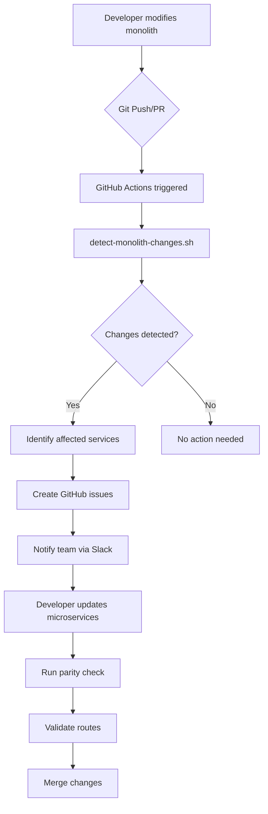

# Monolith to Microservices Mapping

This document provides a comprehensive mapping between monolith modules and Stage 3 microservices to ensure proper synchronization during the transition period.

---

## Quick Reference

| Monolith Module | Stage 3 Microservice | Port | Status |
|-----------------|---------------------|------|--------|
| `auth` | `auth-service` | 4011 | ✅ Active |
| `users` | `user-service` | 4012 | ✅ Active |
| `agency`, `agencies` | `agency-service` | 4050 | ✅ Active |
| `caregiver`, `caregivers` | `caregiver-service` | 4051 | ✅ Active |
| `patient`, `patients` | `patient-service` | 4052 | ✅ Active |
| `residential`, `residence` | `residential-service` | 4060 | ✅ Active |
| `visit`, `visits` | `visit-service` | 4013 | ✅ Active |
| `evv`, `clock-in` | `evv-service` | 4020 | ✅ Active |
| `scheduling`, `shifts` | `scheduling-service` | 4054 | ✅ Active |
| `care-plan`, `care-plans` | `care-plan-service` | 4019 | ✅ Active |
| `emar`, `vitals`, `medications`, `clinical` | `patient-service` | 4052 | ✅ Active |
| `communication`, `messaging` | `communication-service` | 4026 | ✅ Active |
| `notification`, `notifications` | `notification-service` | 4010 | ✅ Active |
| `payment`, `billing`, `invoice` | `payment-service` | 4015 | ✅ Active |
| `contract`, `contracts` | `contract-service` | 4055 | ✅ Active |
| `training`, `certification` | `training-service` | 4024 | ✅ Active |
| `analytics` | `analytics-service` | 4016 | ✅ Active |
| `reports` | `reports-service` | 4070 | ✅ Active |
| `ai`, `matching` | `matching-service` | 4023 | ✅ Active |
| `feedback`, `survey` | `feedback-service` | 4025 | ✅ Active |
| `wellness` | `wellness-service` | 4014 | ✅ Active |
| `mentorship`, `mentor` | `mentorship-service` | 4035 | ✅ Active |
| `admin` | `admin-service` | 4036 | ✅ Active |
| `moderation` | `moderation-service` | 4037 | ✅ Active |
| `audit` | `audit-service` | 4017 | ✅ Active |
| `fraud` | `fraud-detection-service` | 4040 | ✅ Active |
| `security` | `security-monitoring-service` | 4041 | ✅ Active |
| `integration` | `integration-service` | 4056 | ✅ Active |
| `file`, `upload` | `file-service` | 4021 | ✅ Active |
| `search` | `search-service` | 4022 | ✅ Active |
| `provincial`, `ontario`, `quebec` | `provincial-service` | 4034 | ✅ Active |
| `care-network`, `networking`, `coffee-meets` | `care-network-service` | 4033 | ✅ Active |
| `feature-flags` | `feature-flags-service` | 4042 | ✅ Active |
| `insurance` | `insurance-service` | 4057 | ✅ Active |
| `care-request` | `care-request-service` | 4053 | ✅ Active |

---

## Detailed Module Mapping

### Core Services

#### Auth Module → auth-service

| Monolith File | Microservice Equivalent |
|---------------|------------------------|
| `modules/auth/auth.controller.ts` | `services/auth-service/src/controllers/auth.controller.ts` |
| `modules/auth/auth.service.ts` | `services/auth-service/src/services/auth.service.ts` |
| `modules/auth/strategies/*.ts` | `services/auth-service/src/strategies/*.ts` |
| `modules/auth/guards/*.ts` | `services/auth-service/src/guards/*.ts` |
| `modules/auth/dto/*.ts` | `services/auth-service/src/dto/*.ts` |

**Key Entities:**
- `User` - Base user entity
- `RefreshToken` - Token management
- `Session` - User sessions
- `Role`, `Permission` - RBAC

---

#### Users Module → user-service

| Monolith File | Microservice Equivalent |
|---------------|------------------------|
| `modules/users/users.controller.ts` | `services/user-service/src/controllers/user.controller.ts` |
| `modules/users/users.service.ts` | `services/user-service/src/services/user.service.ts` |
| `modules/users/entities/*.ts` | `services/user-service/src/entities/*.ts` |

**Key Entities:**
- `UserProfile` - Extended profile
- `UserPreferences` - Settings
- `UserAddress` - Addresses

---

### Domain Services

#### Agency Module → agency-service

| Monolith Path | Microservice Path |
|---------------|------------------|
| `modules/agency/` | `services/agency-service/src/` |
| `modules/agencies/` | `services/agency-service/src/` |
| `modules/job-postings/` | `services/agency-service/src/modules/job-postings/` |
| `modules/applications/` | `services/agency-service/src/modules/applications/` |
| `modules/interviews/` | `services/agency-service/src/modules/interviews/` |

**Key Entities (43 total):**
- `Agency` - Core agency
- `AgencyBranch` - Branches
- `AgencyLicense` - Licensing
- `AgencyInsurance` - Insurance
- `JobPosting` - Job posts
- `Application` - Applications
- `Interview` - Interviews
- Plus 36 more...

---

#### Caregiver Module → caregiver-service

| Monolith Path | Microservice Path |
|---------------|------------------|
| `modules/caregiver/` | `services/caregiver-service/src/` |
| `modules/caregivers/` | `services/caregiver-service/src/` |
| `modules/caregiver-profile/` | `services/caregiver-service/src/modules/profile/` |
| `modules/caregiver-availability/` | `services/caregiver-service/src/modules/availability/` |

**Key Entities (25 total):**
- `Caregiver` - Core caregiver
- `CaregiverProfile` - Profile details
- `CaregiverCertification` - Certifications
- `CaregiverAvailability` - Scheduling
- `CaregiverSkill` - Skills
- Plus 20 more...

---

#### Patient Module → patient-service

| Monolith Path | Microservice Path |
|---------------|------------------|
| `modules/patient/` | `services/patient-service/src/` |
| `modules/patients/` | `services/patient-service/src/` |
| `modules/emar/` | `services/patient-service/src/modules/emar/` |
| `modules/vitals/` | `services/patient-service/src/modules/vitals/` |
| `modules/medications/` | `services/patient-service/src/modules/medications/` |

**Key Entities (20+ total):**
- `Patient` - Core patient
- `PatientProfile` - Profile
- `Medication` - Medications
- `MedicationAdministration` - eMAR
- `VitalSign` - Vitals
- `Allergy` - Allergies
- `Diagnosis` - Diagnoses

---

#### Residential Module → residential-service

| Monolith Path | Microservice Path |
|---------------|------------------|
| `modules/residential/` | `services/residential-service/src/` |
| `modules/residence/` | `services/residential-service/src/` |
| `modules/group-homes/` | `services/residential-service/src/modules/homes/` |

**Key Entities (20 total):**
- `Residence` - Properties
- `ResidenceRoom` - Rooms
- `ResidentAssignment` - Assignments
- `DailyNote` - Notes
- `SeriousOccurrence` - Incidents
- Plus 15 more...

---

## Synchronization Process

### When Monolith Changes



### Step-by-Step Process

1. **Developer makes changes to monolith**
   ```bash
   # Edit monolith files
   vim apps/medi-aide-backend/src/modules/agency/agency.service.ts
   ```

2. **Commit and push**
   ```bash
   git add .
   git commit -m "feat(agency): add new feature"
   git push
   ```

3. **Automated detection runs**
   - GitHub Actions workflow triggers
   - `detect-monolith-changes.sh` runs
   - Affected microservices identified

4. **Review generated report**
   - Check `reports/monolith-changes-*.md`
   - Review GitHub issue created
   - Check Slack notification

5. **Update microservices**
   ```bash
   # Navigate to affected service
   cd services/agency-service
   
   # Make corresponding changes
   vim src/services/agency.service.ts
   
   # Run tests
   npm test
   ```

6. **Validate parity**
   ```bash
   ./scripts/check-parity.sh
   ./scripts/validate-all-routes.sh
   ```

7. **Commit microservice changes**
   ```bash
   git add services/agency-service/
   git commit -m "feat(agency-service): sync with monolith changes"
   git push
   ```

---

## Scripts Reference

| Script | Purpose | Usage |
|--------|---------|-------|
| `detect-monolith-changes.sh` | Detect monolith changes since a commit | `./scripts/detect-monolith-changes.sh HEAD~5` |
| `check-parity.sh` | Compare entities/controllers count | `./scripts/check-parity.sh` |
| `validate-all-routes.sh` | Test all Kong routes | `./scripts/validate-all-routes.sh` |
| `test-all-kong-routes.ts` | Detailed route testing | `npx ts-node scripts/test-all-kong-routes.ts` |

---

## CI/CD Integration

### Workflow Triggers

| Event | Action |
|-------|--------|
| Push to `apps/medi-aide-backend/` | Run parity check |
| PR affecting monolith | Comment with affected services |
| Weekly schedule | Full parity report |
| Manual dispatch | On-demand check |

### Required Secrets

```yaml
SLACK_WEBHOOK_URL: Slack notification webhook
GITHUB_TOKEN: Auto-created for issue creation
```

---

## Best Practices

### DO

1. ✅ Always run parity check after monolith changes
2. ✅ Update microservices in the same PR when possible
3. ✅ Add tests for any new functionality
4. ✅ Document breaking changes
5. ✅ Use feature flags for gradual rollout

### DON'T

1. ❌ Merge monolith changes without updating microservices
2. ❌ Skip parity validation
3. ❌ Ignore GitHub issues created by automation
4. ❌ Deploy monolith changes without microservice sync
5. ❌ Bypass the synchronization process

---

## Troubleshooting

### "Service not found in mapping"

Add the new module to the mapping in `detect-monolith-changes.sh`:

```bash
# Add to MODULE_TO_SERVICE array
["new-module"]="new-service"
```

### "Parity below threshold"

1. Run detailed check: `./scripts/check-parity.sh --detailed`
2. Review missing entities
3. Create missing files in microservices
4. Re-run parity check

### "Route validation failing"

1. Check Kong is running: `curl http://localhost:8001/status`
2. Verify service is running: `docker-compose ps`
3. Check route configuration: `grep "service-name" gateway/kong.yaml`

---

## Contacts

| Role | Responsibility |
|------|----------------|
| Backend Lead | Monolith changes review |
| Microservices Team | Service synchronization |
| DevOps | CI/CD pipeline issues |
| Architect | Mapping updates |
